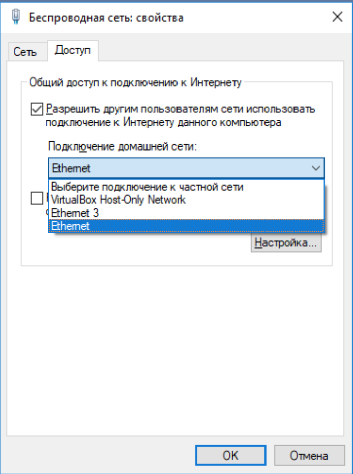

# Настройка машинок

Запоните правила работы с OrangePI:
>Всё подключил, потом включил!

- Выбираем и скачиваем образ:
	- [armbian](https://www.armbian.com/orange-pi-zero/)
	- [lubuntu](http://www.orangepi.org/downloadresources/orangepizero/2017-05-11/orangepizero_7f7ec2c4c22d7bd4d0d5fab.html)

## На windows

### Скачаем проги

- [Win32 Disc Imager](https://sourceforge.net/projects/win32diskimager/)
- [SD Card Foramatter](https://www.sdcard.org/downloads/formatter/)
- [Putty](https://www.chiark.greenend.org.uk/~sgtatham/putty/latest.html)
- [Wireshark](https://www.wireshark.org/download.html)

### Настроим сеть

1. В настройках подключения по Ethernet включаем автоматическое назначение IPv4 // TODO: Вставить скрин
2. В настройках подключения по безпроводной сети открываем доступ в интернет из сети Ethernet 

	

3. На комп в сети Ethernet будет назначен IP `192.168.X.1`. Стоит запомнить этот адрес

### Раскатаем образ

1. Вставляем карту в комп
2. Форматируем с помощью _SD Card Formatter_
3. Открываем _Win32 Disk Imager_, выбираем нужный образ, нажимаем `Write`
4. Ждём, пока образ запишется на карту
5. Вставляем карту в **ВЫКЛЮЧЕННУЮ** машинку

### Подключение

1. Подключаем Ethernet кабель к **ВЫКЛЮЧЕННОЙ** машинке
2. Открываем _Wireshark_ и начинаем слушать Ethernet
3. Подаём питание на машинку
4. Ждём, пока в _Wireshark_ не появится адрес машинки/ Он будет как адрес компа, только на конце не `1` и не `255`
5. Открываем _Putty_
6. Выбираем тип подключения ***SSH***, вводим адрес машинки, нажимаем ***Открыть***

#### Породолжение в пункте ["Настройка"](#На-windows)