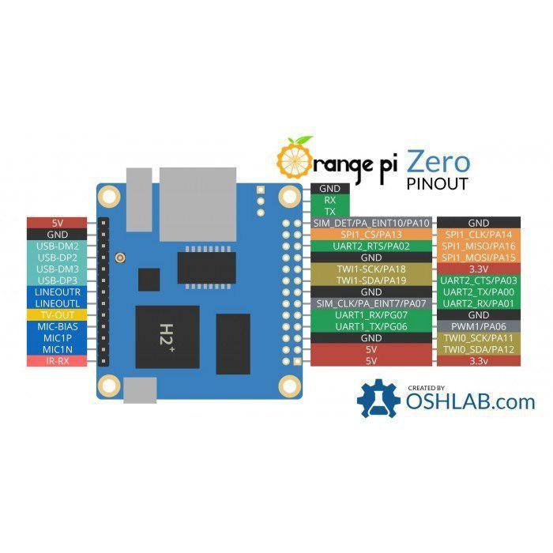

# Если у вас не работают UART'ы

(Инструкция Влада Еганова)

1. Выключаем питание машинки;
2. Подключаем провода. Распиновка:

	

3. Включаем машинку, подключаемся к ней;
4. В `/boot/armbianEnv.txt`, в строку _overlays_, дописываем через пробел: `uart1 uart2`;
5. Перезагружаемся: `sudo reboot`;
6. Проверяем:
	```
	python3 1.py /dev/ttyS1
	python3 1.py /dev/ttyS2
	```
